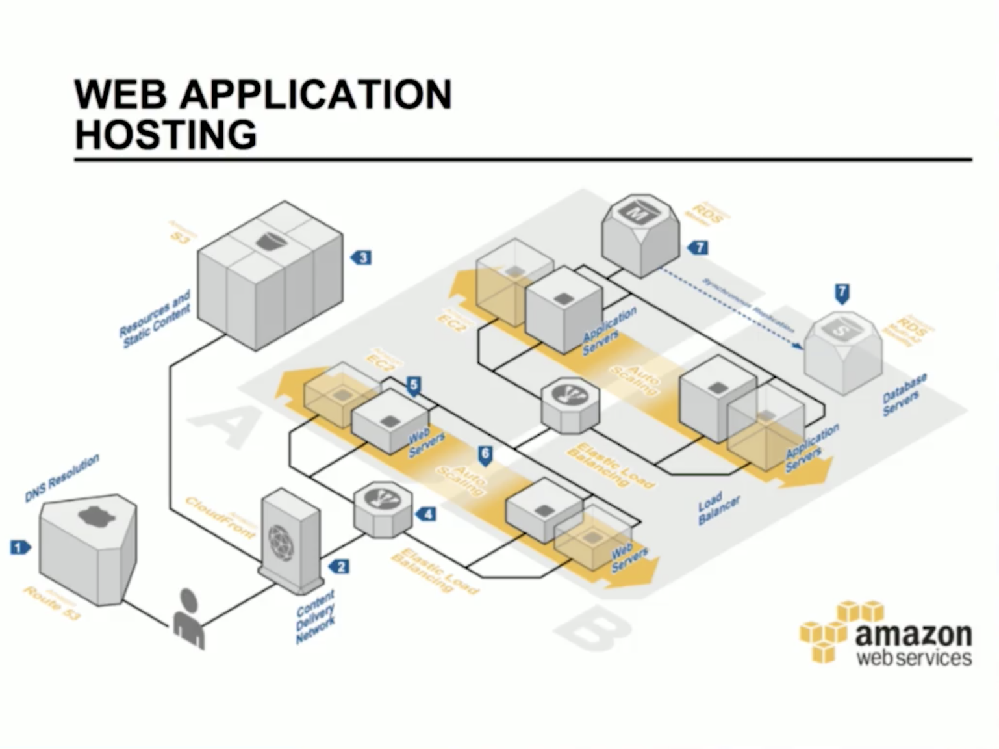

# softwareArchitecture
Software Architecture

# Stages of the software development process
The traditional development process has very marked stages, which have inputs, processes and outputs that function as inputs to the next stage.

* A.1. **Analysis of requirements:** Everything is born from a trigger that creates the need to create an artifact or a system. We need to understand what the problem is that we want to solve. There are business requirements, functional requirements, non-functional requirements.

* A.2. **Solution design:** Deep analysis of problems to work together and propose possible solutions. The result of this should be the detail of the solution, through requirements, modeling, etc.

* B.1. **Development and evolution:** Implementation of the solution, to guarantee that what is being built is what is expected. At the end of this stage we will have a software artifact.

* B.2. **Deployment:** Here we will need infrastructure and operational roles to be able to make the device available.

* B.3. **Maintenance and evolution:** Development + deployment + maintenance, at this stage we are attentive to possible improvements made to the system. At this stage the software is maintained until the software is no longer needed.

# Difficulties in software development
At the design and development stage we are focused on finding out what problems we want to solve. These problems can be divided into two main types of problems.

**Essential:** We can divide them into 4.
1. The complexity, when what we have to solve is complex in itself, for example calculating the best route between cities.
2. Compliance.
3. Tolerance for change.
4. Invisibility.

**Accidentals:** It's related to the platform that we're going to implement, technology, languages, frameworks, integrations, etc.

# Roles
It's important that we differentiate the ROL of the job, there are roles that can be developed by the same person.

* **Domain expert:** In a traditional methodology, he's the person we go to understand the needs of the business. In Agile methodologies -> stakeholders.

* **Analyst:** functional / business, the person responsible for defining the requirements that will lead the software to a successful port. In the case of Ágiles, the owner of the product is the one who assembles the stories and who accompanies us in the process of building the software.

* **System Administrator / DevOps:** It's the role of operations and development, they're the people responsible for the infrastructure that will host our application.

* **Development team:** QA / Testing are in charge of evaluating our software, checking that what is being done is what is expected to be done. Developers involved in building the software. Architect, designs the solution and analyzes the requirements, is a more strategic role. The architecture emerges from the work of a well-managed team.

* **Project manager / facilitator:** They lead the team through the iterative and incremental process, understand what is happening with the team and motivate progress in product development.

# What is software architecture?

It is the structure of the system, composed by software elements, their visible properties and their relationships.

It is the main set of design decisions made for the system.

Architecture comes down to the important things, whatever they are.

Examples:

Twitter architecture component diagram

AWS deployment diagram

Flux data flow diagram

# Conway's Law
A company or organization will be able to generate structures that mimic the communication path of their organization.

It can be a monolithic system where all the equipment is together.
It can also be divided by teams artificially or organizationally, achieving a distributed application where each team owns their application and then communicate more clearly.

# Architect's Goals
The architect connects the stakeholders with the system to be built. Each one of the roles that the SH have affect in a different way the system.

Stakeholders - Functional and non-functional requirements

# Architecture and methodologies

Traditional methodologies

Agile methodologies

# Understand the problem
The problem space details what I am going to solve.

The space of the solution goes into the detail of how I am going to solve the problem.
